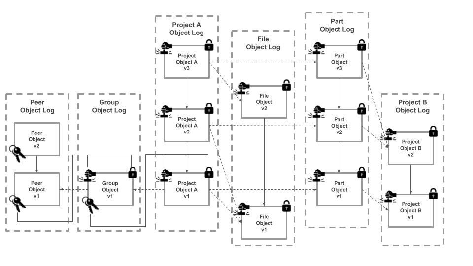

# Hex - A distributed application protocol for revision control of engineering documents

[Jeremiah Wagstaff](mailto:jeremiah@omnibuilds.com)  |  [OmniBuilds](https://www.omnibuilds.com)  |  February 24th 2018

## Abstract

Hex is a distributed application protocol that tracks the revision history of engineering documents for a hardware design.  It allows a group of peers to maintain a shared copy of all files and metadata for a design project across a public or private peer to peer network. Documents are stored in a content addressed local file system while meta data is stored as a collection of append only logs that each take the general form of a blockchain.  Each block represents the state or version of a particular object, such as a Computer Aided Design (CAD) file or a project's Bill of Materials (BOM).  Blocks are published and validated locally by each peer without the need for a network connection or global consensus.  Each block is encrypted and may only be accessed by a member of the group with the appropriate permissions.  Files and blocks are shared through a transport agnostic replication protocol, with a peer only storing the files and data relevant to them.  Projects and documents may be created and edited through a cross platform desktop app which maps all project data to a local desktop folder.  A relay server may be used as a persistent peer; providing backups, constant sync, and the ability to share project data through a web application.  Designs may be persisted and made readily available to the entire network by storing content on the InterPlanetary File System (IPFS) through FileCoin and mediating the reuse of designs through a smart license, implemented as an Ethereum smart contract.  Storage fees and licensing transaction costs can be paid through the hex public utility token, the medium of exchange across the greater hex network.  This allows for the creation of a distributed, interoperable, versioned and CAD agnostic library of engineering designs that could be seen as 'GitHub for Hardware' or 'Wikipedia for Parts' and serve as the foundation for a smart manufacturing supply chain.

## 1. Introduction

Engineers who design physical objects, loosely defined as *hardware*, have two basic options for tracking the shared revision history of a design project across a group of users.  Either use an enterprise grade Product Lifecycle Management (PLM) or Product Data Management (PDM) application, or adapt a non-standard substitute system towards those purposes.  For the vast majority of engineers, the first option is unattainable, while the second option provides only a partial solution.  The result is a hardware engineering ecosystem with high barriers to entry, poor interoperability between implementations, and frequent instances of rework or 'reinventing the wheel'. Together, these factors create artificial limitations on the pace of hardware innovation with implications that propagate throughout the entire manufacturing supply chain.  The aim of hex is to provide a third option, by creating an open industry standard for the distributed revision control of engineering documents, similar to the way that git has become the de facto industry standard for software revision control.  

### PLM & PDM

PLM is the gold standard for engineering document control and is typically seen at large vertically integrated engineering firms in the automotive, aerospace, and defense industries.  While PLM is an incredibly powerful tool that can support tens of thousands of users across a shared workspace, it is also prohibitively expensive for most small to medium engineering firms, with annual licenses up to $100k per user.  PLM applications create silos of engineering data locked in proprietary formats that are not interoperable across vendors, within or between firms.  They are often over-featured for common use cases and have a steep user learning curve that results in high organizational implementation costs.  PDM applications offer a more limited set of features but are often tied to specific CAD vendor or formats, and share many of the pitfalls of PLM.  For these reasons, PLM and PDM are not a realistic option for many small to medium engineering firms.  Even at large firms, it is rare to find an engineer who enjoys using the chosen PLM or PDM system, and they will readily provide a laundry list of complaints and recommended improvements.

### Substitutes

A wide array of substitute revision control systems exist that fall into three main categories: using generic file sharing services, adapting software revision control tools, or experimenting with web based hardware collaboration tools.

File sharing services, such as Dropbox and Google Drive, provide an easy to implement collaboration solution but fail to scale beyond a handful of users and have a weak notion of versioning.  More importantly, they are not built for the use case of hardware, meaning they have no way to render CAD files, no notion of a BOM, and no method handling an approval workflow like an Engineering Change Order (ECO).

Software revision control tools, such as git, have been adapted for the use case of hardware by several open source hardware projects and hardware startups.  But as many users have learned, these tools also fail to scale due to the volume of large binary files (CAD files) that are present in hardware projects which are not efficiently versioned in a system designed to manage text based software code.  See [Git](#git) for a more detailed discussion.

A variety of web based hardware collaboration tools have also been created that offer many interesting alternatives but are not suited for professional use.  Web applications such as Thingiverse and GrabCAD provide a means to publicly share the design files and some meta-data for a non-versioned engineering project.  Other tools have tried to migrate specific aspects of a design project to the browser, including OnShape (for Mechanical CAD), Upverter (for electronic CAD), OpenBOM (for BOM management), and Dozuki (for documentation management.  While these tools are useful for their specific task, they only manage a slice of a projects data, requiring the overlay of a more complex integration or system to effectively manage an entire project across a team.  Also, none of these solutions provide a simple mapping to a local folder (like dropbox) to provide a seamless method of syncing local and remote content.   

## 2. Background

Hex is based on several popular distributed protocols including Git, IPFS, the DAT Project, and Secure Scuttlebut.  Hex combines elements each of these projects into something new that is built for the use case of public and private collaboration on hardware designs.  Let us examine each in turn, noting the limitations for hardware project management and what elements have been incorporated into hex.  

### Git

[Git](https://git-scm.com/) is a distributed revision control protocol that allows software engineers to easily track the version history of a software project and collaborate with other in a distributed, asynchronous workflow.  Over the last decade, Git has become the revision control tool of choice for software engineers and has spawned a vibrant community and diverse ecosystem of third party tools. This has led many hardware engineers, especially those who are familiar with software best practices, to experiment with using git to manage a hardware project.  

Git was designed to be very efficient at diffing, patching, and storing software code, which are essentially text files.  Since hardware projects are largely composed of large binary files (such as CAD files, documentation, and spreadsheets) git cannot diff or patch them for efficient storage.  Every new version of a file is tracked with the full file, instead of a diff or patch (i.e. just storing the changes).  Git was also designed to efficiently handle repositories up to about 1 GB in size, which are very large for a software project but is on the low end of the scale for a hardware project.  Together, these two design features create large, slow git repositories when used for tracking a hardware project.  The git community has attempted to overcome this limitation through the creation of a variety of plugins, the two most popular being [Git Large File Storage (LFS)](https://git-lfs.github.com/), officially endorsed by GitHub, and [Git Annex](https://git-annex.branchable.com/), more generally adopted in the open source community.  Both of these provide a workaround by storing the large binary files outside of the git repository through a symbolic link, such as a url.  This simply offloads file storage to a centralized server but does not get at the root problem of efficiently storing large binary files locally.  

Usability and complexity are another drawback that have prevented the more widespread adoption of git for hardware project management.  Most hardware engineers are not comfortable with the command line, and the complexity of the git schema and combination of possible commands can be difficult for many to grasp for practical use.  While the community has developed several outstanding graphical clients such as GitHub Desktop and Git Kraken, these tools are primarily built for managing software projects, not hardware projects, and at best expose a files system that then requires a maintainer to enforce a hardware project schema across an organization (e.g. a BOM).  

Git is an excellent tool for managing software code, but it does not meet the requirements of a universal tool for managing a hardware project.  We can take the core tenets of the git philosophy and adapt them to the use case of hardware.  These include a content addressable file system, linking of versioned records via their cryptographic hash in a directed acyclic graph (DAG) or Merkle Tree, storing records as a linked list of deltas or changes, an offline-first approach that stores a full local copy of the repository on each node, and a conflict resolution strategy to handle merging of divergent branches to support distributed workflows.  By combining these tenets with recent developments in distributed storage and peer to peer protocols, the opportunity now exists to build a truly distributed hardware collaboration tool.  

### The InterPlanetary File System (IPFS)

"[IPFS](https://ipfs.io/) is a peer-to-peer distributed file system that seeks to connect all computing devices with the same system of files."  IPFS is also inspired by and built on top of Git, and at a high level acts a single shared git repository.  The goal of IPFS is to replace http by making the web permanent. IPFS is the can also be understood as a framework of protocols that govern the tracking, versioning, discovery and replication of data between untrusted nodes in a peer to peer network over any transport protocol.  In this way IPFS presents a solution to the more general problem of building a better version of the World Wide Web.  

Could IPFS be used to track and synchronize hardware project data across a group of users?  Yes, but only in a limited sense more akin to a public dropbox folder.  The first problem is that IPFS does not have a permission or access control scheme built into the discovery or replication protocols.  The only way to publish private data is to encrypt it, very carefully exchange private keys or pass phrases with peers, and then selectively set which peers can discover the data.  Assuming you could secure the data the next problem is ensuring that it is actually replicated and becomes permanent, which requires other peers to discover, replicate, and host your data while ensuring that at least one peer is always online to persist the data.  For private groups this means the replication is limited by the size of the group, and for public groups or projects its limited by it's popularity.  To handle the persistence problem, the company behind IPFS, Protocol Labs, is preparing to launch a service built on top of IPFS called FileCoin that incentives the mining (hosting) of data across the IPFS network, by allowing farmers to repay them through the FileCoin token.  At the time of this writing FileCoin remains a work in progress.  

The combination of IPFS & FileCoin could be used in the future to create a persistent public layer for hex projects that are meant to be exchanged and reused or licensed in a public design marketplace.  But this is not required for the hex protocol to function across an isolated set of public and private peer to peer networks today.  In the meantime IPFS provides an excellent set of modular peer to peer networking protocols, [LibP2P](https://libp2p.io/), that is utilized by hex as the network layer of the application stack.   

### DAT Project

"[Dat](https://datproject.org/) is a protocol designed for syncing folders of data, even if they are large or changing constantly." It is primarily concerned with the selective replication of large data sets in the TB to PB range for the scientific and academic communities.  Dat is also inspired by git and has similarities to IPFS, in that objects are versioned, content addressed and linked into a Merkle DAG data structure.  

While Dat is very good at synching large data sets, certain features make it unsuitable for hardware project management.  Like IPFS, there is no inherent security model. The only way to protect a sensitive dat repository is to limit discovery or encrypt the contents, with the same problems as mentioned earlier for IPFS.  Dat projects are shared via private links that give users read only access to a projects contents.  At this time, there is no method for collaborative editing of a shared project, making Dat a non-starter.  Furthermore, Dat does not store the full revision history of a project on each node.  Rather it relies on a central server to act as the dataset archive and only stores a requested version of the data set on each peer machine.  This makes sense considering the size of the data sets being shared but would lead to a poor user experience for the use case of hardware project management, requiring a network connection and replication every time a past revision needs to checked out.

Like IPFS, Dat is also built using a modular set of libraries for different layers in the application stack.  While not incorporated directly into hex, several of these libraries including [hyperlog](https://github.com/mafintosh/hyperlog) and [hyperdrive](https://github.com/mafintosh/hyperdrive) serve as a model for the hex data and file storage schemas.  These libraries, along with the core data model of Dat were inspired by another distributed application protocol, Secure Scuttlebut.   

### Secure Scuttlebut (SSB)

"[Secure Scuttlebutt](https://ssbc.github.io/secure-scuttlebutt/) is a database protocol for unforgeable append-only message feeds.  "Unforgeable" means that only the owner of a feed can update that feed, as enforced by digital signing through ED25519 key pairs."  SSB generalizes the data structure of a blockchain or Merkle DAG into an extensible schema that can be used to create a series of types for use as the model layer of a distributed application.  Data is encapsulated in the type property of each block which takes the form of a Conflict Free Replicable Data Type (CRDT).  Data is persisted through any key-value store style database, with the key being the hash of the value.  CRDTs allows for the replication protocol to seamlessly merge logs between peers through a gossip protocol, modeled on the way human beings disseminate information in social settings.  Two unique properties of SSB logs is that they do not require a global blockchain for consensus and they do not require a distributed hash table (DHT) for discovery.  SSB logs also include end to end encryption as they are built for privacy.  SSB has been used to build a variety of interesting peer to peer [applications](http://scuttlebot.io/apps/index.html) including a peer to peer social network (patchwork), git hosting service (git-ssb), and music publishing service (ferment).

While SSB could be used to build the foundation for hex, it would not handle the storage of large binary files efficiently or be able to manage access control at a level required for an enterprise grade application.  SSB does provide the blueprint for the kind of distributed data model that makes sense for the hex protocol and its implementation of a gossip protocol handles replication across the network in an efficient and scalable fashion.  Accordingly, much of the hex protocol is modeled after SSB.

## 3. Hex Protocol

A traditional public blockchain, such as bitcoin, was designed to operate over a single public network of untrusted peers.  It combines a global consensus protocol with a distributed ledger where each block is made up of a list of transactions, or state changes.  There is only a single chain, and all transactions since the last block are bundled into a single new block, which anyone may add, as long as they satisfy the rules of the global consensus protocol. Blocks are linked via their cryptographic hash and transactions are addressed using a hash of the public key of senders and recipients. Full nodes are required to to keep a copy of the entire blockchain.  All transactions are published publicly and may be inspected by anyone.

Hex is designed to operate over multiple public and private networks, where users may be invited and given access based on a pre-existing level of trust.  It combines a local consensus protocol with a distributed ledger, where each block represents the state change of a single data object or record.  Blocks are an abstract base class which can be used to generate a schema of many different data types.  There are many chains, which represents the lifecycle of a given instance of any type in the schema, such as the version history of an engineering project. Any peer may start a new chain, for any type in the schema, by publishing a block that is signed by the private key of the group the peer and block belong to.  That chain may then be extended by any peer who has read-write access for that group, which allows them to sign a new block with the same key.  Since all blocks in a chain must have the same signature, any peer can immediately validate a new block locally, without the need for a global consensus.  Each peer only keeps a copy of the object logs (chains) that they need, not all logs.  Public chains have their block contents published in the open as clear text, while the contents of private chains are encrypted using a group private key.

### Blocks

Each block is a simple key-value pair stored as JSON, with four standard properties:
* Creator: The SHA256 hash of the RSA public key for the group that created this block.  
* Data: A JSON object representing the content of the block, which may be of any type (see data types).  This property is encrypted for private groups.
* Time Stamp: The unix timeStamp for when the block was created and added to the chain
* Signature: The cryptographic signature of the data object, generated using the RSA private key for the group that created this block.

```javascript
block = {
  key: hash(value),
  value: {
    creator: hash(rsa_public_key),
    data: { ... },
    timeStamp: unix_timestamp,
    signature: sign(data, rsa_private_key)
  }
}
```

The key for each block is the cryptographic hash of its value, resulting in a unique, consistently reproducible result that serves as the digital fingerprint for the block and its data.  This method of content addressed storage is central to the internal consistency of the chain.  If any of the data stored in the value of block is changed, the hash will change resulting in a new key, preventing an existing block from being changed (for a given id) and allowing anyone on the network to validate the consistency of the block by comparing the hash of its value to its key.

The data content of each block is signed with the RSA private key of its creator, resulting in a unique signature that may be validated by anyone on the network using the publicly available public key of its creator.  This validates the authenticity of the block by confirming that it was actually generated by the creator.

A block may contain links to other blocks, reflecting a previous version of the data that is being recorded.  These links form a chain, which is a log or feed of the changes for a given data type or record over time.  A new chain is created by adding a genesis block, or a block that has no links.  Blocks may only be added, never modified, or deleted.  

Only the creator of a block may extend the chain by publishing a new block.  This allows for simple authentication of new blocks on an existing chain, by checking if the parent block has the same creator public key.  Peers may share read/write access to chains through the use of a shared group private key.  

#### Validating Blocks

Once a new block has been published and shared, any peer can validate the authenticity of the block and the consistency of the chain by applying the rules of consensus described above.

1. Does the block id (key) match the SHA256 hash of the block value?
2. Does the signature of the block match the public key of the creator?
3. Does the creator id of the block match the creator id of it's parent (if it is not a genesis block)

This means that only nodes who have access to the requisite group private key may add authentic blocks to the chain.  

#### Blocks (and chains) are permissioned

All chains and blocks within a group are permissioned through a set of shared group RSA key pairs with different access capabilities. Information is kept secret by encrypting the data content of a block using one of the group private keys.  The Open PGP standard is used to generate all key pairs and encrypt all blocks since it is designed to allow for decryption with multiple public keys.  

Hex identities may be of two types, peers and groups.  Peers represent individual users while groups represent teams or organizations of peers with shared access to a set of projects.  Project blocks may only be created by groups but are tagged with the id of the peer who created them.  When a new peer is created (when a user installs hex for the first time) a unique RSA key pair is generated.  Both keys are stored locally.  The public key is shared openly across the network but a peer private key is never shared with anyone, nor is it exposed to the user.  

A default group is also created for the peer, allowing them to create projects for that group.  A separate RSA key pair is generated for the group identity.  Instead of being shared locally, this key pair is embedded in the data attribute of the group block, giving anyone with read access to the group block the ability to read and write new blocks for the group.  This group block is then encrypted with the private key of the peer (owner) and the public keys of each peer who is a member of the group.  Now any member of the group can access the group public and private keys, but only the group owner (the peer who created it) may publish a new group block with a valid signature, making the owner the only peer who can change the members of the group.  

When the group is created it will be segmented into four sub groups, each with a distinct RSA key pair.  First the admin group is created by the group owner, which restricts who can add and remove peers to the read/write and read only groups.  Then three derivative group objects are created by the admin group: read/write group, read only group, and the ACL group.  

#### Permission Model


1. Admin Group: Signed by the group owner, stores a list of all peers who may alter the members of other groups and encrypted with their public keys.
2. Read/Write Group: Signed by the admin group, stores a list of all peers who can read and write new blocks for the group, encrypted with their public keys.  All derivative group objects are signed with this private key.
3. Read Only Group: Signed by the admin group, stores a list of all peers who read new blocks for the group, encrypted with their public keys.
4. ACL Group: Signed by the admin groups, stores a list of all peers in the group and their authority levels, encrypted with the public keys of all members of the group.  This allows group members to validate the authority level of a group peer before replicating new blocks during sync.  

Multiple levels of authority may be created by nesting sub groups under a shared parent.  For example you could create a nested group for a distinct team within an organization, which would be a new admin group signed by the existing admin group, and a further set of access control groups for the sub group.  

If a new user is added to a group or an existing user is removed from a group, the corresponding group blocks will be re-encrypted using
the public keys of all new group members.  Members who have been removed from the group will no longer be able to read or write new blocks, nor will they receive blocks that they do not have access through the replication protocol (discussed here).  

### Hex Schema (Block Types)

Data encapsulated in a block may be one of several types, which together make up the schema.  Each type has a prototype that defines the expected properties and primitive values.  Hex includes a handful of pre-defined types, the bare minimum needed to operate the network, but it is easily extensible through the creation of new types.  There are five pre-defined types.  Peers and Groups (described above) are used for identity and have their own RSA public and private key pairs.  Projects, Parts, and Files make up the content types which represent the bulk of the data stored in the application.  Projects are the root container for a design and could be used to store the data for any part, assembly, or complete product.  Each project contains an array of parts, which are other projects tracked at a particular version with a given quantity -- essentially the next level down in an indented BOM.  Projects also contain an array of files which represent the design files or documentation, but are generally CAD.  Parts and files can be nested within projects at any number of levels, allowing for the tracking of complex, hierarchical BOMs.

#### Block Types and Relations



#### Peer

```javascript
data = {
  type: 'peer',
  parent: parent_block_key,
  name: string,
  email: string,
  publicKey: hash(rsa_public_key),
  privateKey: hash(rsa_private_key),
}
```

#### Group

```javascript
data = {
  type: 'group',
  parent: parent_block_key,
  editor: peer_id,
  name: string,
  publicKey: hash(rsa_public_key),
  privateKey: hash(rsa_private_key),
  secret: string,
  members: [peerIds]
}
```

#### Project

```javascript
data = {
  type: 'project',
  editor: peer_id,
  parents: [parent_block_key, ...],
  name: string,
  build: boolean,
  revision: string,
  message: string,
  files: [file_block_key, ...],
  parts: [part_block_key, ...],
}
```

#### File

```javascript
data = {
  type: 'file',
  editor: peer_key,
  parents: [parent_block_key, ...],
  key: string,
  name: string,
  base: string,
  patch: string,
}
```

#### Part

```javascript
data = {
  type: 'part',
  editor: peer_key,
  parents: [parent_block_key, ...]
  project: project_key,
  quantity: integer,
}
```

### File storage

Every version of all files across all projects are tracked locally in a blob archive using an approach that combines delta storage, compression, encryption, and content addressing.  

Versioning large binary files without some form of delta storage can quickly lead to overly large repositories that are not practical for local storage.  Hex solves this problem by only storing the changes between binary files.  The first time a new file is added to a project the entire file is saved and serves as the base.  Any subsequent versions that are added will be compared using a binary diff tool, with only the resulting patch being stored.  When a file needs to be checked out at a particular version, the base and patch will be concatenated to produce the original file.  If the base and patch begin to diverge too much a new base will be generated to keep patches as small as possible.  

Once a base or patch has been created it is then compressed using the Brotli Compression algorithm, resulting in a further size reduction of 3 - 10 X based on the file type.  Compressed files are then encrypted using AES symmetric keys that are generated randomly each time a file is versioned.  A unique key is stored for each block in the file object log, meaning that only a peer who has access to the group key corresponding to that file block can decrypt the corresponding file.

As a final step the SHA256 hash of each file is computed and used as the name and address for local storage in a content-addressed blob store.  This serves to deduplicate files both locally and across the network, while allowing anyone to validate the authenticity of a file and its contents.  The hash address is then stored in the data property of the corresponding file block, creating a link between the block database and the local file system.

### Local Hex Folder

The currently selected revision of all hex projects are exposed to the user through a local hex folder.  Each root project is exposed as a folder that contains all files for that revision, and a folder for each part in the BOM (prefixed with an underscore).  The corresponding part folder will expose a similar folder mapped to it's corresponding project.  This allows the full BOM and a files for each part to be mapped into a file system.

The BOM structure and corresponding files can be synced in both directions.  Users may add files and folders directly to the local folder which is watched by the hex client.  When a new revision to that project is published the BOM and design files will be adjusted to match the structure of the project folder, with each file also added to the archive in the manner described above.  If a user switch to a past revision of the project through the client, the corresponding files will be reassembled from the archive and be rendered in the local folder.  

### Replication Protocol

Once a peer has published a change to any block in the database these updates can be shared directly with other peers over the network.  Hex relies on LibP2P to abstract the network layer out of its protocol and provide a transport agnostic solution.  The reference implementation is to connect via WebRTC when syncing directly with peers and WebSockets when syncing with a hex relay server.  Regardless, a relay server is used to maintain a list of active peers and their network addresses.

Once a connection has been established between two peers, the sync begins by establishing that peers are in fact members of the same group by exchanging authentication messages encrypted and signed with their private keys.  One both peers establish that they are who they say they are they check to see who has the latest copy of the Group ACL object and sync that object first.  They can now verify that each other's status and permissions in the group, which is cross-referenced for every block before it is exchanged.  

As an added security measure, each peer will adjust their own local access to blocks if required by a new ACL that has restricted their access.  For example Alice is the admin for a group and has changed Bob's permissions from read-write to read-only, Bob will go through and delete all of his local copies of the read-write group block as well as the read-write keys stored in the archive, and then wait for Alice to send him the read-only group blocks so he can then construct the read-write key pair that he can now use to access project blocks.

After peers have made any necessary adjustments they will exchange a list of heads, an index that displays the latest version of each block for each chain in their local database.  The heads will be compared to compute a delta for each peer.  Peers will simultaneously compute their own deltas or receive lists, exchange them, and then compare with the expected delta, referenced against the latest group ACL, to compute a send list.  Once peers agree on deltas
they will begin a full duplex streaming transfer of all authorized blocks and corresponding files.    

Once block transfers are complete each peer will recompute and share head lists to verify that their local copies are fully in sync.  These transactions are then logged locally by each peer to prevent replay attacks, preventing an impostor or malicious peer from request the same blocks again.

### Security

Even though the hex protocol assumes a higher level of trust between peers than most distributed applications, since they must be invited into a group, it still takes a rigorous approach to security that is enforced at multiple levels and handles all imaginable worst case scenarios. Security is enforced at the local level through block encryption using RSA asymmetric key pairs and file encryption use AES symmetric keys. Security is enforced at the network level through the replication protocol which will strictly abide by the group ACL.

Only peers with the appropriate permissions may gain access to the group private keys, which allows them to sign and encrypt any blocks for that group.  In the event that a peer manages to extract the group private keys by hacking the protocol or locating and decrypting them within the archive, and shares these keys with malicious actors or stores them outside the protocol in case their permissions are later revoked, they will still not be able to publish new blocks outside of their local repository.

The replication protocol is designed to strictly prohibit the sending and receiving of blocks between peers who do not have the requisite authority in the ACL.  This prevents users from both receiving blocks they should not have access to and publishing invalid blocks.

## 4. Hex Network Architecture

The hex protocol has a reference implementation in javascript, optimized for a Node runtime environment.  This core library can then be embedded into an desktop application and a web server, and also adapted to run in the browser.  These three elements form the core of the hex network, allowing content to be generated and stored locally, backed up and shared over a server, and consumed by anyone through a web application.

### Hex Desktop Client

The hex client is cross-platform desktop application with a graphical user interface built with the electron framework.  It allows a peer to manage a local hex folder where it exposes the currently selected revision or draft of a project, while viewing the metadata for the project within the app itself.  Files and metadata for the full version history of all projects is stored in a hidden .hex folder with all data encrypted at rest through a combination of asymmetric and symmetric key cryptography.  Files are stored as binary diffs and patches in a content addressable blob store.  Metadata is stored in a local LevelDB database as a series of append only feeds that are hash-linked, signed, and encrypted by a set of common group keys that are shared amongst the peer group.  Each peer in the group only stores the blocks that they have the correct access rights for and that they need for a given project.  Peers are able to discover each other and sync by communicating with a relay server.

### Hex Relay Server

The hex relay server is a persistent peer that ensures there is always at least one peer online.  It also allows peers to easily discover and sync with one another while giving them access to the most current version of the group ACL.  It can also serve as backup for all files and blocks within the group, provide a mechanism for key recovery, the registration of multiple hardware devices to a single peer, and handle invitations and validation for new peers.  It can also serve content over the web to external users through the hex web app.  A relay server may be used to manage one or more groups of unrelated peers.  It is built as a bare bones Node Express server running the hex protocol as a daemon, with the ability to host multiple federated LevelDB instances and content-addressed blob stores.    

### Hex Web App

Groups may wish to share read only copies of hex projects to external users over a standard web protocol such as https to a browser.  The hex web application allows peers to share read only links to specific revisions that will render in the browser.  It is a Vue.js single page application that communicates with the hex relay server over a GraphQL API.  In the future, a modified version of the hex protocol could be run in the browser using LevelDB to allow web based peers to publish updates to a project.

## 5. Future Work: Persisting and Monetizing Hex Repositories

Groups may also wish to persist their data outside of the internal peer network and make it available to the engineering community at large.  This functionality is provided in part through the hex relay server but only by introducing the traditional IT dilemma: trust a 3rd party service to host your data, which may go out of business, mine that data, or expose it to hackers through security faults; or incur the technical overhead and management costs of self-hosting the data on premises.  A decentralized hosting protocol provides a third option -- to persist data across the network in a cryptographically secure manner, at a lower total cost and with a higher assurance of security.  This decentralized protocol could be thought of as a public utility, or digital infrastructure, which would continue to exist as long as nodes and peers remain incentivized to participate in the network.

These incentives could be formalized programattically through the creation of a Hex Public Utility Token (HUT) which would serve as the medium of exchange across the network.  Hex projects could then be published publicly (unencrypted) or privately (encrypted) on the network by expending HUT.  Data could be persisted on IPFS or a similar distributed storage network while design reuse could be regulated through a smart license, such as an Ethereum smart contract embedded in each repository.  HUT would be used to cover the storage and compute costs associated with publishing while providing bonuses to incentivize the sharing and reuse of projects as transaction costs.  All public designs would be indexed by the protocol and easily searchable though either the desktop or web apps.  Since all hex projects are tracked in a standard interoperable format, parts from one supplier or designer could easily be imported into another project, if allowed by the license.  

Parts suppliers could make their catalogs available as public hex repositories, reducing the friction hardware engineers experience when searching for parts to gather data sheets and CAD models.  The smart license could require that importing a part into the BOM of a private project would cost a fractional amount of hex, which would be transferred back to the supplier.  Hardware companies of all sizes could publish proprietary designs publicly in order to increase licensing opportunities and monetize designs, perhaps only for designs that have already been released as open source hardware or have been granted patents.  The smart license could allow for a fork, or clone of the design which would dictate that any subsequent HUT generated from this design would be shared between parties at a predetermined ratio, and might also include an up-front licensing fee.  This system provides opportunities to both earn and spend hex token on the network, while incentivizing public participation and design reuse.

This network could also be used as the foundation for a smart manufacturing supply chain.  Since the hex block schema is extensible, new types could be added to represent individual builds or lots of manufactured goods down to the smallest end component.  Instances of these types could link back to a published revision of hex design repository.  HUT could be used to mediate these transactions as well.  Builds could be published to create a digital chain of custody showing which design a build was made from, who purchased it, what larger assembly or product it was included in and who the end user or customer was.  This system would be an excellent tool for digital fabrication technologies such as 3D printing and CNC machining where physical objects are produced directly from digital files.  Manufacturers could provide prototyping and production services on the network that were also purchased in HUT.  Freelancer engineers and design consultancies could also provide design services on the network that are also mediated through HUT.

## References

Benet, Juan. IPFS - Content Addressed, Versioned, P2P File System (DRAFT 3)

Buterin, Vitalik. Ethereum - A Next-Generation Smart Contract and Decentralized Application Platform

Chacon, Scott and Ben Straub. Pro Git, 2nd Edition. 2014 Apress.

Merkle, Ralph. Protocols for Public Key Cryptosystems. ELXSi International Sunnyvale, Ca.

Nakamoto, Satoshi. Bitcoin: A Peer-to-Peer Electronic Cash System

Ogden, Mawell, Karissa McKelvey, Mathias Buus Madsen, Code for Science. Dat - Distributed Dataset Synchronization And Versioning. May 2017

Protocol Labs.  Filecoin: A Decentralized Storage Network. August 14, 2017

Tarr, Dominic. Designing a Secret Handshake: Authenticated Key Exchange as a Capability System. July 10, 2015

Van Renesse, Robbert, Dan Dumitriu, Valient Gough, Chris Thomas. Efficient Reconciliation and Flow Control for Anti-Entropy Protocols. Amazon.com, Seattle.
